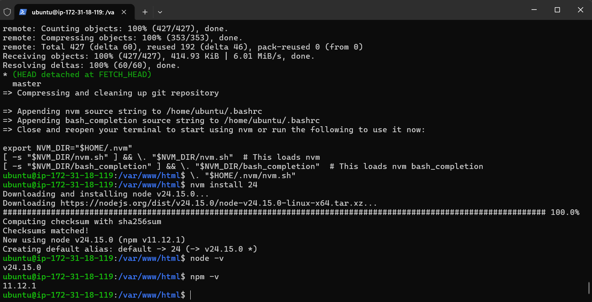
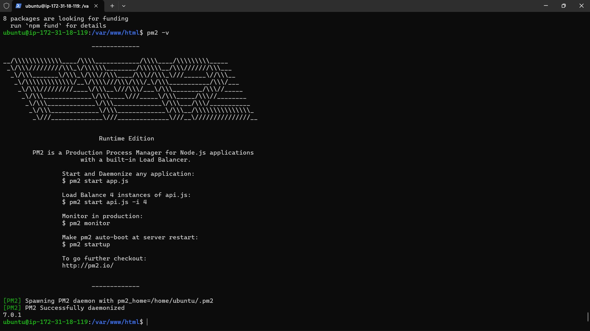

# Migration Standalone Folder to Indtance AWS EC2

1. Upload standalone.zip via SFTP (Fillezilla)
2. Connect Open SSH (ssh -i keyfilenam.pem ubuntu@IP)
    - patching os -> sudo apt update && sudo apt upgrade
3. Install tools unzip -> sudo apt install unzip -y
4. cd /var/www/html
5. extract standalone.zip - unzip standalone.zip
6. Install Interpreter untuk Apps base node.js sesuai dokumentasi resmi
    - Download and install nvm: -
    curl -o- https://raw.githubusercontent.com/nvm-sh/nvm/v0.40.4/install.sh | bash
    - in lieu of restarting the shell -
    \. "$HOME/.nvm/nvm.sh"
    - Download and install Node.js: -
    nvm install 24
    - Verify the Node.js version: -
    node -v # Should print "v24.15.0".
    - Verify npm version: -
    npm -v # Should print "11.12.1".
    
    - Install PM2 untuk session state -> npm install pm2@latest -g
    - pm2 -v
    
8. Export - Import DB
    - start DBMS (Laragon, xampp, dll)
    - Export dbcompro
    - Hapus ENGINE=InnoDB DEFAULT CHARSET=utf8mb4 COLLATE=utf8mb4_general_ci
    -
