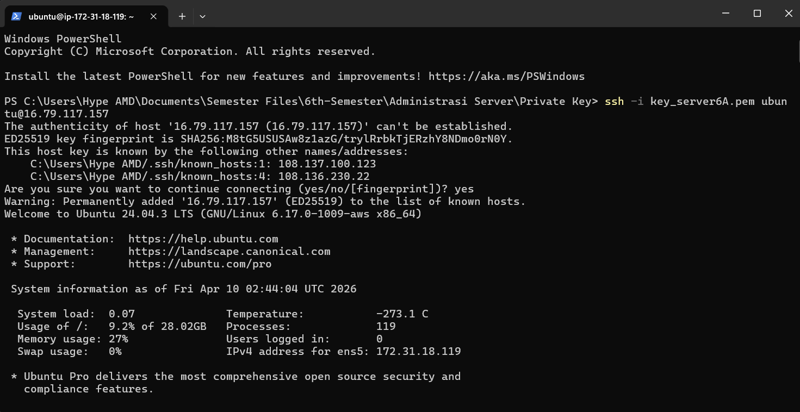
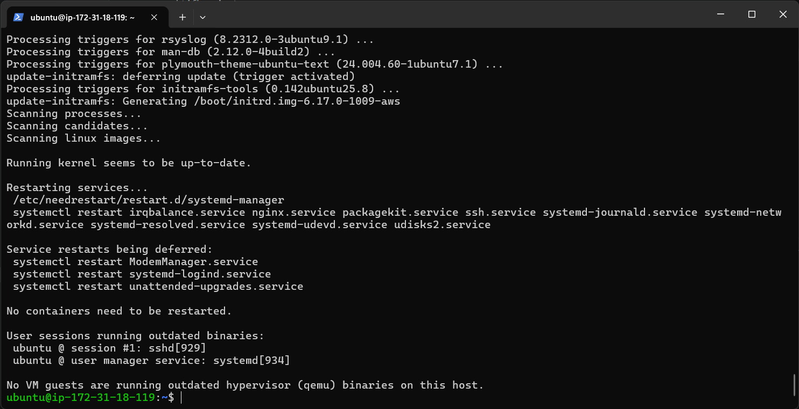
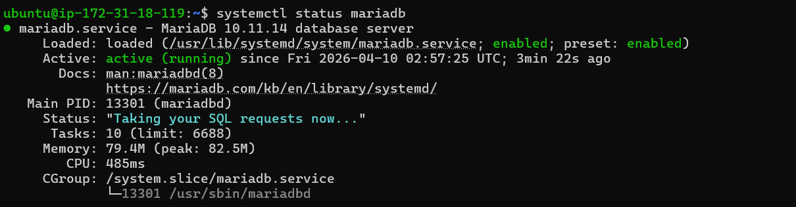
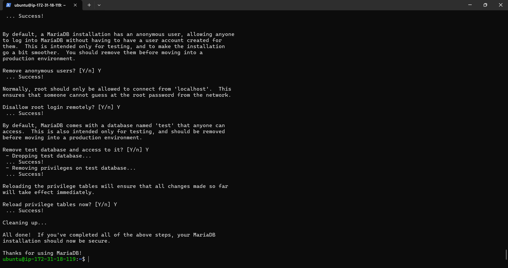
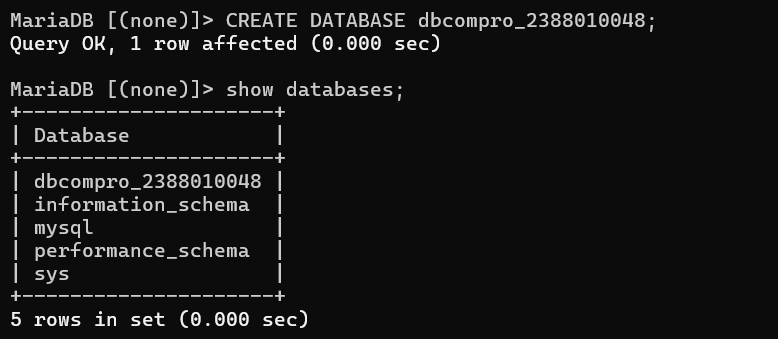
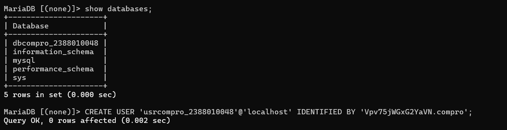
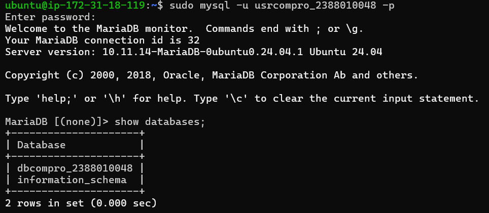

# Setting up Database di AWS EC2 menggunakan MariaDB

1. Aktifkan instance AWS EC2
2. Remote Instance via Open SSH Powershell (bisa juga dengan putty)

3. Patching OS (sudo apt-get update && sudo apt-get upgrade)

4. Install MariaDB (sudo apt install mariadb-server -y)
5. Cek Status MariaDB (systemctl status mariadb)

6. Tes Default Setting database server login
    sudo mysql -u root -p
    show databases;
[alt text](image-3.png)
7. Hardening Database Server (sudo mysql_secure_installation)
    - Change the password for the root user = Y
    - Remove anonymous users = Y
    - Disallow root login remotely = Y
    - Remove test database and access to it = Y
    - Reload privilages tables = Y

8. Create DB untuk Website Company Profile (CREATE DATABASE)
    - login sebagai root
    - create DB nama dbcompro_NIM

    - create user (CREATE USER 'usrcompro_NIM'@'localhost' IDENTIFIED BY '[Password]';)

    - grant user akses ke DB yang baru dibuat => GRANT ALL PRIVILEGES ON dbcompro_2388010048.* TO 'usrcompro_2388010048'@'localhost'; 
    - flush privileges (FLUSH PRIVILEGES;)
    - login sebagai user
