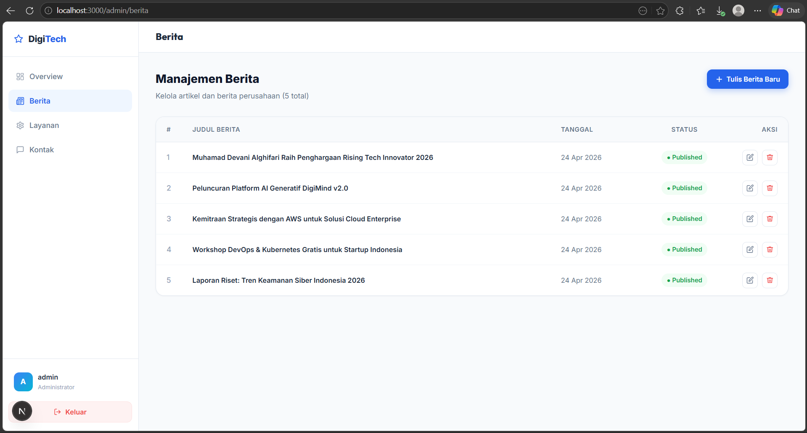

# Deploy Web Apps Framework Next.js ke AWS

1. Pastikan Web Apps berjalan di local
    - install dependency 'npm install' di terminal
    - create db dengan nama dbcompro_NIM dan import schema.sql dari folder sql di dalam folder compro
    - create file .env dan isi sesuaikan
    - jalankan web apps 'npm run dev'
    - akses web apps di browser 'http://localhost:3000'
    - testing front-end pastikan tampilan muncul tanpa error
    - testing back-end http://localhost:3000/admin
        username: admin
        password: admin123
    
    - create static file -> 'npm run build'
    - archive folder standalone -> zip -> klik kanan folder standalone -> compress to -> compressed (zipped) folder